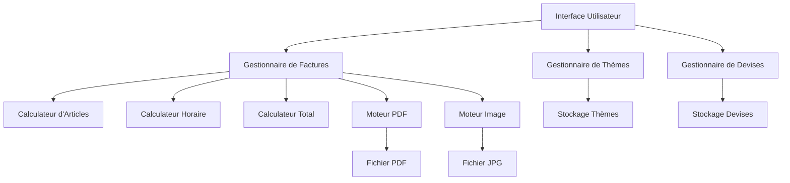
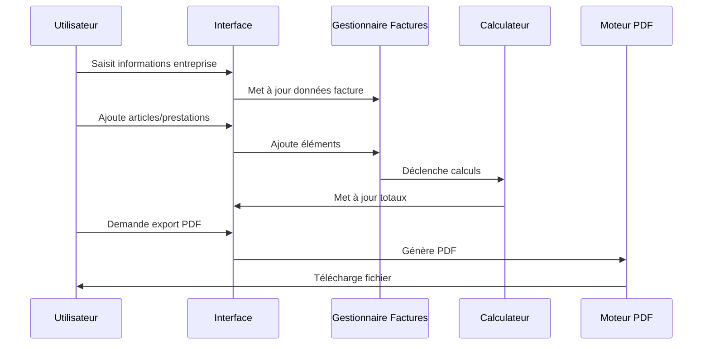

# Document de Conception

## Vue d'Ensemble

Le générateur de factures professionnelles est une application web single-page développée en HTML/CSS/JavaScript vanilla. L'architecture privilégie le traitement côté client pour garantir la confidentialité des données, avec génération PDF intégrée et personnalisation graphique avancée.

## Architecture

### Architecture Générale



### Flux de Données



## Composants et Interfaces

### 1. Gestionnaire de Factures (InvoiceManager)

**Responsabilités:**
- Gestion de l'état global de la facture
- Coordination des calculs
- Orchestration des exports

**Interface:**
```javascript
class InvoiceManager {
    constructor()
    setCompanyInfo(companyData)
    addItem(item)
    removeItem(itemId)
    updateItem(itemId, updates)
    calculateTotals()
    exportToPDF()
    exportToJPG()
    applyTheme(themeId)
    setCurrency(currencyCode)
}
```

### 2. Calculateur d'Articles (ItemCalculator)

**Responsabilités:**
- Calculs pour articles standards
- Application des remises et TVA

**Interface:**
```javascript
class ItemCalculator {
    calculateLineTotal(quantity, unitPrice, discount, vatRate)
    calculateSubtotal(items)
    calculateTotalDiscount(items)
    calculateTotalVAT(items)
}
```

### 3. Calculateur Horaire (HourlyCalculator)

**Responsabilités:**
- Calculs spécifiques aux prestations horaires

**Interface:**
```javascript
class HourlyCalculator {
    calculateHourlyTotal(hours, hourlyRate)
    calculateHourlySubtotal(hourlyItems)
}
```

### 4. Gestionnaire de Thèmes (ThemeManager)

**Responsabilités:**
- Application des thèmes prédéfinis
- Gestion des personnalisations

**Interface:**
```javascript
class ThemeManager {
    loadThemes()
    applyTheme(themeId)
    customizeColors(colorConfig)
    customizeFonts(fontConfig)
    resetToDefault()
}
```

### 5. Gestionnaire de Devises (CurrencyManager)

**Responsabilités:**
- Gestion des devises et formatage
- Application des conventions locales

**Interface:**
```javascript
class CurrencyManager {
    loadCurrencies()
    setCurrency(currencyCode)
    formatAmount(amount)
    getSymbolPosition()
}
```

### 6. Moteur PDF (PDFEngine)

**Responsabilités:**
- Génération PDF côté client
- Rendu fidèle A4

**Interface:**
```javascript
class PDFEngine {
    generatePDF(invoiceData, theme)
    setPageFormat()
    addHeader(companyInfo)
    addBody(items)
    addFooter(footerText)
    download(filename)
}
```

## Modèles de Données

### Facture (Invoice)

```javascript
{
    id: string,
    number: string,
    date: Date,
    company: CompanyInfo,
    items: Array<Item>,
    hourlyItems: Array<HourlyItem>,
    totals: Totals,
    theme: string,
    currency: string,
    customization: Customization
}
```

### Informations Entreprise (CompanyInfo)

```javascript
{
    name: string,
    logo: File | null,
    address: string,
    phone: string,
    email: string,
    legalInfo: string
}
```

### Article (Item)

```javascript
{
    id: string,
    reference: string,
    description: string,
    quantity: number,
    unitPrice: number,
    discount: number, // pourcentage
    vatRate: number,  // pourcentage
    lineTotal: number // calculé
}
```

### Prestation Horaire (HourlyItem)

```javascript
{
    id: string,
    description: string,
    hours: number,
    hourlyRate: number,
    total: number // calculé
}
```

### Totaux (Totals)

```javascript
{
    subtotalHT: number,
    totalDiscount: number,
    totalVAT: number,
    totalTTC: number
}
```

### Thème (Theme)

```javascript
{
    id: string,
    name: string,
    colors: {
        primary: string,
        secondary: string,
        text: string,
        background: string
    },
    fonts: {
        header: string,
        body: string,
        numbers: string
    },
    layout: {
        headerHeight: string,
        margins: string
    }
}
```

### Devise (Currency)

```javascript
{
    code: string, // ISO 4217
    symbol: string,
    name: string,
    symbolPosition: 'left' | 'right',
    decimalPlaces: number,
    thousandsSeparator: string,
    decimalSeparator: string
}
```

## Propriétés de Correction

*Une propriété est une caractéristique ou un comportement qui doit être vrai pour toutes les exécutions valides d'un système - essentiellement, une déclaration formelle sur ce que le système doit faire. Les propriétés servent de pont entre les spécifications lisibles par l'homme et les garanties de correction vérifiables par machine.*

<function_calls>
<invoke name="prework">
<parameter name="featureName">invoice-generator

### Réflexion sur les Propriétés

Après analyse des critères d'acceptation, plusieurs propriétés peuvent être consolidées pour éviter la redondance :

- Les propriétés de validation des champs obligatoires (3.1-3.4, 4.1-4.3) peuvent être regroupées en propriétés de validation générale
- Les propriétés de calcul (3.7, 4.4, 5.1-5.4) forment un ensemble cohérent de calculs automatiques
- Les propriétés de personnalisation (7.4-7.9) peuvent être regroupées en propriétés de personnalisation générale
- Les propriétés de sécurité (10.1-10.3) forment un ensemble cohérent de protection des données

### Propriétés de Correction

**Propriété 1: Format A4 des factures**
*Pour toute* facture générée, les dimensions du document doivent correspondre exactement au format A4 (210 × 297 mm) avec des marges adaptées à l'impression
**Valide: Exigences 1.1, 1.3**

**Propriété 2: Structure de document**
*Pour toute* facture générée, le document doit contenir trois sections distinctes : en-tête, corps et pied de page
**Valide: Exigences 1.2**

**Propriété 3: Informations d'entreprise complètes**
*Pour toute* facture avec informations d'entreprise saisies, toutes les données (nom, coordonnées, informations légales, numéro de facture) doivent être correctement stockées et affichées
**Valide: Exigences 2.1, 2.3, 2.4, 2.5**

**Propriété 4: Upload de logo valide**
*Pour tout* fichier image valide uploadé comme logo, le système doit l'accepter et l'afficher correctement sur la facture
**Valide: Exigences 2.2**

**Propriété 5: Timestamp automatique**
*Pour toute* facture créée, la date et l'heure de création doivent être automatiquement ajoutées et correspondre au moment de création
**Valide: Exigences 2.6**

**Propriété 6: Validation des articles**
*Pour tout* article ajouté, le système doit rejeter les articles manquant des champs obligatoires (référence, description, quantité, prix unitaire)
**Valide: Exigences 3.1, 3.2, 3.3, 3.4**

**Propriété 7: Calcul automatique des articles**
*Pour tout* article avec quantité, prix unitaire, remise et TVA définis, le total de ligne calculé doit correspondre exactement à : (quantité × prix unitaire × (1 - remise/100)) × (1 + TVA/100)
**Valide: Exigences 3.7**

**Propriété 8: Validation des prestations horaires**
*Pour toute* prestation horaire ajoutée, le système doit rejeter les prestations manquant des champs obligatoires (description, heures, taux horaire)
**Valide: Exigences 4.1, 4.2, 4.3**

**Propriété 9: Calcul automatique des prestations horaires**
*Pour toute* prestation horaire avec heures et taux horaire définis, le total calculé doit correspondre exactement à : heures × taux horaire
**Valide: Exigences 4.4**

**Propriété 10: Mélange d'éléments de facturation**
*Pour toute* facture, le système doit permettre d'inclure simultanément des articles standards et des prestations horaires
**Valide: Exigences 4.5**

**Propriété 11: Calculs de totaux cohérents**
*Pour toute* facture avec éléments de facturation, les totaux calculés doivent respecter : sous-total HT = somme de tous les éléments HT, total TTC = sous-total HT + total TVA - total remises
**Valide: Exigences 5.1, 5.2, 5.3, 5.4**

**Propriété 12: Réactivité des calculs**
*Pour toute* modification d'un élément de facture, tous les totaux doivent être recalculés et mis à jour immédiatement
**Valide: Exigences 5.5**

**Propriété 13: Complétude des devises ISO 4217**
*Pour toute* devise de la norme ISO 4217, elle doit être disponible dans le sélecteur de devises du système
**Valide: Exigences 6.2**

**Propriété 14: Formatage des devises**
*Pour toute* devise sélectionnée, les montants doivent être formatés selon les conventions locales de cette devise (position du symbole, séparateurs)
**Valide: Exigences 6.4, 6.5**

**Propriété 15: Disponibilité des polices**
*Pour toute* catégorie de police (sans-serif, serif, monospace), au moins une police de cette catégorie doit être disponible dans la bibliothèque
**Valide: Exigences 7.1**

**Propriété 16: Nombre de thèmes**
*Pour tout* système initialisé, le nombre de thèmes prédéfinis disponibles doit être compris entre 5 et 10
**Valide: Exigences 7.2**

**Propriété 17: Application complète des thèmes**
*Pour tout* thème sélectionné, toutes ses propriétés (couleurs, typographie, mise en page) doivent être appliquées simultanément à la facture
**Valide: Exigences 7.3**

**Propriété 18: Personnalisation graphique**
*Pour toute* modification de personnalisation (couleur texte, fond, majuscules, titres, pied de page, mode de paiement), le changement doit être immédiatement visible sur la facture
**Valide: Exigences 7.4, 7.5, 7.6, 7.7, 7.8, 7.9**

**Propriété 19: Export PDF A4**
*Pour tout* export PDF demandé, le fichier généré doit être un PDF valide au format A4 sans watermark
**Valide: Exigences 8.1, 8.4**

**Propriété 20: Export JPG haute résolution**
*Pour tout* export image demandé, le fichier généré doit être un JPG valide haute résolution sans watermark
**Valide: Exigences 8.2, 8.4**

**Propriété 21: Traitement côté client**
*Pour tout* export (PDF ou JPG), aucune requête réseau ne doit être effectuée vers un serveur externe
**Valide: Exigences 8.5**

**Propriété 22: Performance des calculs**
*Pour tout* calcul effectué, le temps de traitement doit être inférieur à 100ms
**Valide: Exigences 9.1**

**Propriété 23: Temps de chargement**
*Pour tout* chargement initial de l'application, le système doit être prêt à l'utilisation en moins de 2 secondes
**Valide: Exigences 9.2**

**Propriété 24: Réactivité de l'interface**
*Pour toute* modification d'un élément, la mise à jour de l'affichage doit être immédiate (< 50ms)
**Valide: Exigences 9.3**

**Propriété 25: Absence de stockage serveur**
*Pour toute* opération effectuée, aucune donnée utilisateur ne doit être envoyée ou stockée sur un serveur externe
**Valide: Exigences 10.1, 10.2**

**Propriété 26: Absence de persistance**
*Pour toute* session fermée, aucune donnée utilisateur ne doit persister dans le navigateur après fermeture
**Valide: Exigences 10.3**

**Propriété 27: Compatibilité desktop**
*Pour toute* fonctionnalité du système, elle doit fonctionner parfaitement sur les navigateurs desktop modernes
**Valide: Exigences 11.1, 11.4**

**Propriété 28: Prévisualisation mobile**
*Pour toute* facture, la prévisualisation doit être fonctionnelle sur mobile même si l'édition est limitée
**Valide: Exigences 11.2, 11.3**

## Gestion des Erreurs

### Stratégie de Gestion d'Erreurs

**Validation des Données:**
- Validation côté client en temps réel
- Messages d'erreur contextuels et explicites
- Prévention de la soumission de données invalides

**Gestion des Fichiers:**
- Validation des types de fichiers pour les logos
- Gestion des erreurs d'upload
- Limitation de la taille des fichiers

**Gestion des Calculs:**
- Protection contre la division par zéro
- Validation des nombres négatifs
- Gestion des débordements numériques

**Gestion des Exports:**
- Gestion des erreurs de génération PDF/JPG
- Messages d'erreur explicites en cas d'échec
- Fallback gracieux si les exports échouent

## Stratégie de Test

### Approche de Test Dual

Le système utilisera une approche de test combinant tests unitaires et tests basés sur les propriétés :

**Tests Unitaires:**
- Exemples spécifiques démontrant le comportement correct
- Cas limites et conditions d'erreur
- Points d'intégration entre composants

**Tests Basés sur les Propriétés:**
- Propriétés universelles valides pour toutes les entrées
- Couverture complète des entrées par randomisation
- Validation des 28 propriétés de correction définies

### Configuration des Tests Basés sur les Propriétés

**Framework:** fast-check (JavaScript)
**Configuration:**
- Minimum 100 itérations par test de propriété
- Chaque test de propriété doit référencer sa propriété du document de conception
- Format de tag : **Feature: invoice-generator, Property {number}: {property_text}**

**Équilibre des Tests:**
- Les tests unitaires se concentrent sur des exemples spécifiques et des cas limites
- Les tests de propriétés gèrent la couverture extensive des entrées
- Les deux approches sont complémentaires et nécessaires pour une couverture complète

### Générateurs de Test Intelligents

**Générateurs de Données:**
- Générateur d'articles avec contraintes réalistes
- Générateur de prestations horaires avec valeurs valides
- Générateur d'informations d'entreprise avec formats corrects
- Générateur de devises basé sur ISO 4217
- Générateur de thèmes avec propriétés cohérentes

**Contraintes de Génération:**
- Quantités positives pour les articles
- Taux de TVA et remises dans des plages réalistes (0-100%)
- Heures et taux horaires positifs
- Formats de fichiers image valides pour les logos
- Codes de devise conformes à ISO 4217